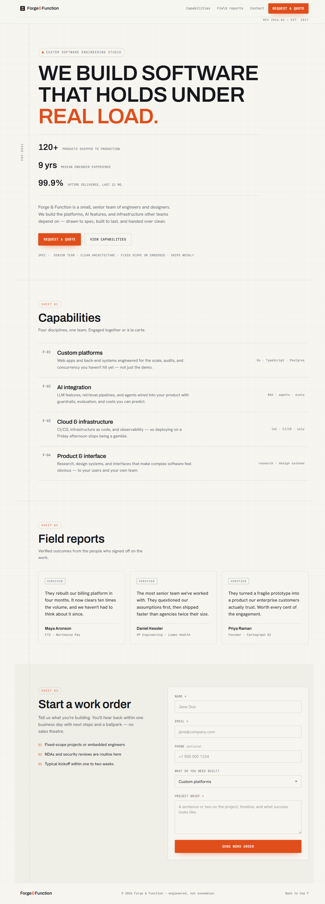

# Forge &amp; Function

A single-page marketing website for a fictional software development studio. Pure static front-end — **HTML + CSS + vanilla JavaScript**, no framework, no build step, no package manager.

🔗 **Live site:** https://alfredang.github.io/softwaredevleopment/



## Features

- Responsive, mobile-first layout
- Sticky navigation with smooth in-page scrolling
- Four anchored sections: Hero, Services, Testimonials, and a Contact enquiry form
- Client-side form validation (config-driven)
- Respects `prefers-reduced-motion` for accessibility
- Custom typography via Google Fonts (Bricolage Grotesque, JetBrains Mono, Hanken Grotesk)

## Project structure

```
.
├── index.html      # Semantic structure — one <main> with four sections
├── styles.css      # All styling; design tokens live in :root CSS variables
├── script.js       # Behavior — enquiry form validation
└── .github/
    └── workflows/
        └── deploy.yml   # GitHub Pages deployment via GitHub Actions
```

## Running locally

There is no dev server or build step — just open the file in a browser:

```powershell
Start-Process index.html   # Windows / PowerShell
```

The only external dependency is Google Fonts, loaded via CDN in the `<head>`. Typography needs an internet connection to render as designed; it falls back to system fonts offline.

## Customizing

- **Theme** — edit the CSS variables in the `:root` block of `styles.css` (palette, radius, shadow, fonts). Don't change colors inline.
- **Form fields** — edit the single `fields` config object in `script.js`. Each field also needs a matching `<input id="x">` and `<span class="error" id="error-x">` in `index.html`.

> Note: the enquiry form has **no real backend**. On submit it validates, logs the collected data to the console, and shows a success message. A commented-out `fetch()` example marks where a real POST would go.

## Deployment

Hosted on **GitHub Pages**, deployed automatically by GitHub Actions on every push to `main` (see [`.github/workflows/deploy.yml`](.github/workflows/deploy.yml)).
